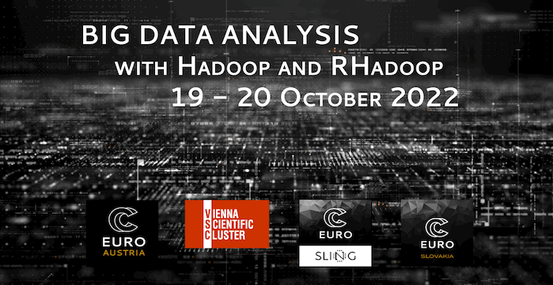

  

## Table of Contents
1. [Description](#description)
2. [Information](#information)
3. [File descriptions](#files)
4. [Certificate](#certificate)

## Description

This training course focused on the foundations of “Big Data” processing by introducing the Hadoop distributed computing architecture and providing an introductory level tutorial for Big Data analysis using Hadoop, Rhadoop, and R libraries parallel, doParallel, foreach and Rmpi. The course had an hands-on approach, allowing participants to work interactively on real data on the High Performance Computing environment of the University of Ljubljana and on the Vienna Scientific Cluster.

This two day course was an EuroCC event, jointly organised by EuroCC Slovenia, EuroCC Slovakia and EuroCC Austria.

## Information

The overall goals of this course were the following:
> - move big data efficiently to a cluster and to Hadoop distributed file system;
> - perform simple big data analysis by Python scripts using MapReduce and Hadoop;
> - work with RStudio and write scripts within R using several state-of-the-art libraries for parallel computations, like parallel, doParallel, foreach and Rmpi;
> - work with libraries for Hadoop, like rmr, rhdfs and rhbase;
> - perform parallel slurm jobs with R scripts.

All attendees were given access to real data on the High Performance Computing environment of the University of Ljubljana and on the Vienna Scientific Cluster.

More detailed information, links and lesson slides for the course can be found on the [course website](https://vsc.ac.at/training/2022/BigData/).

## File descriptions

The notebooks and exercises can be found in this repository and are organized in their respective folders, one for each day of the course:
- [Day 1 - Hadoop, HDFS, MapReduce;](https://github.com/HROlive/Big-Data-analysis-with-Hadoop-and-RHadoop/tree/main/Day%201%20-%20Hadoop%2C%20HDFS%2C%20MapReduce)
- [Day 2 - Big Data management and analysis with Rmpi and RHadoop;](https://github.com/HROlive/Big-Data-analysis-with-Hadoop-and-RHadoop/tree/main/Day%202%20-%20Big%20Data%20management%20and%20analysis%20with%20Rmpi%20and%20RHadoop)

## Certificate

The certificate for the workshop can be found bellow:

["Big Data analysis with Hadoop and RHadoop" - EuroCC Slovenia, EuroCC Slovakia, EuroCC Austria and VSC Research Center]() (Issued On: October 2022)
